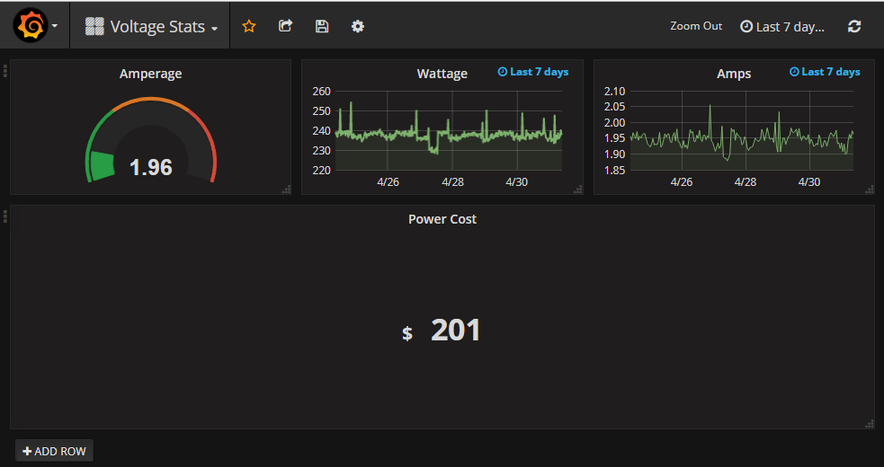

For GadgetSpot per Request-

The quick points:
1. Run the script (In background, loop endlessly) 
2. Set up prometheus to listen for data 
3. Pull data from prometheus using grafana

Grafana.json - this should let you import the same view as above
prometheus.yml - prometheus config file
tplink.py - main python fetch loop

Not covered here: installing prometheus and grafana

Credit where credit is due:

Most of the python code from here, modified to pull data endlessly:
https://github.com/sdelrio/hs110-prometheus-exporter